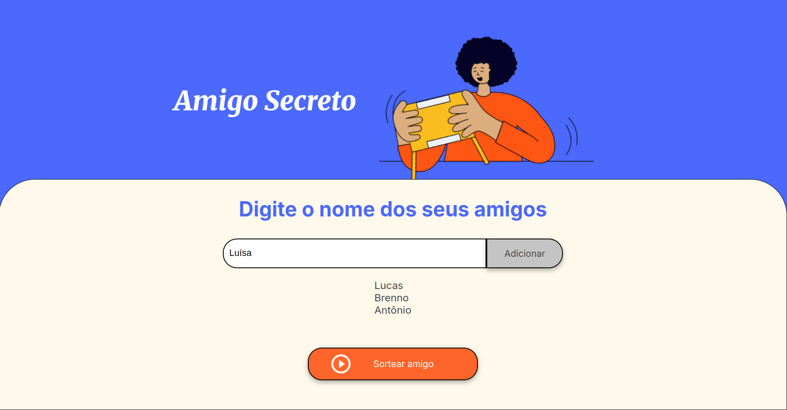

# 🎁 Amigo Secreto  

Um jogo simples de "Amigo Secreto" desenvolvido com **HTML, CSS e JavaScript puro**, sem o uso de frameworks.  

## 🎯 Objetivo do Projeto  

Este projeto tem como propósito fortalecer competências básicas de programação web, como:  
- Uso de **HTML, CSS e JavaScript** para a construção de websites.  
- Manipulação do **DOM** para interatividade.  
- Aplicação dos fundamentos de **estruturas de dados** (arrays, manipulação de listas).  
- Utilização de **funções** para organizar a lógica do jogo.  

## 🚀 Funcionalidades  

- ✅ Adicionar nomes à lista de participantes.  
- ✅ Exibir dinamicamente os nomes adicionados.  
- ✅ Sortear aleatoriamente um nome da lista.  

## 🎮 Como Jogar  

1. Digite um nome no campo de entrada.  
2. Clique no botão **"Adicionar"** para incluí-lo na lista.  
3. Depois de adicionar todos os participantes, clique no botão **"Sortear"**.  
4. O nome sorteado será exibido na tela como o amigo secreto!  

## 📌 Tecnologias Utilizadas  

- **HTML** → estrutura da página.  
- **CSS** → estilo e design.  
- **JavaScript** → lógica do jogo.  

## 📂 Como Executar o Projeto  

1. Baixe ou clone este repositório:  
   ```bash
   git clone https://github.com/lucas-nunes-matheus/amigo-secreto.git
   ```
2. Abra o arquivo `index.html` no navegador.  

## 📷 Preview  

<div align="center">
<sup>Figura 1 - Interface do Jogo</sup>



<sub>Fonte: Material produzido pelos autores(2025).</sub>
</div>

## 📝 Licença  

Este projeto é de código aberto e está sob a licença **MIT**.  